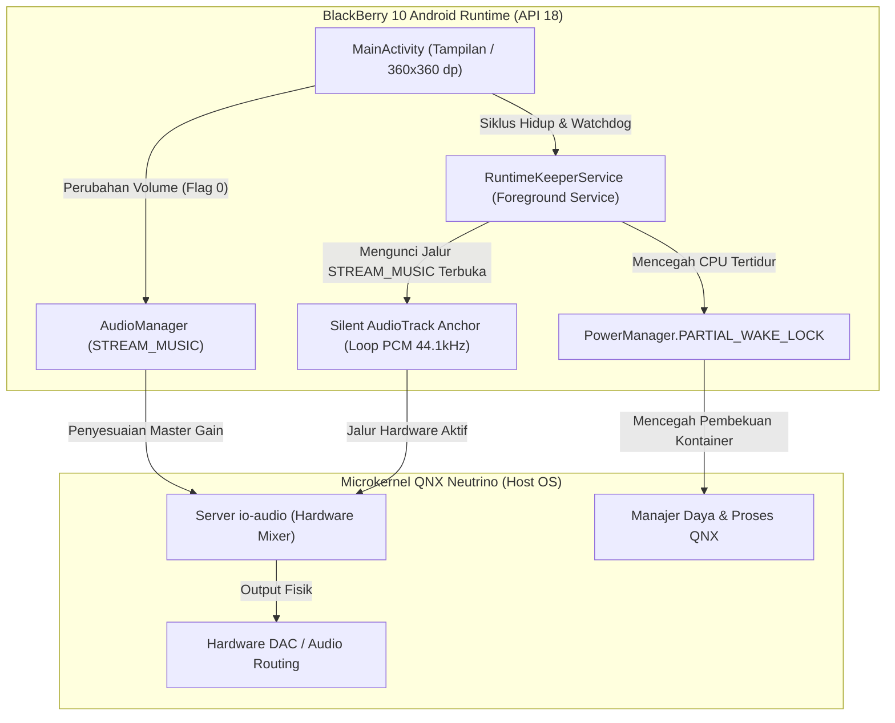

[English](README.md) • **Bahasa Indonesia**

# ClickyBB

### Pusat Kontrol Perangkat Ringan untuk BlackBerry 10 (Android Runtime / API 18)

[-00f0ff?style=for-the-badge&logo=android)](https://developer.android.com)
[-000000?style=for-the-badge&logo=blackberry)](https://blackberry.com)
[-111111?style=for-the-badge)](https://en.wikipedia.org/wiki/BlackBerry_Q10)
[](https://developer.android.com/studio/command-line)
[]()
[](LICENSE)

---

## 1. Gambaran Umum & Motivasi Proyek

**ClickyBB** adalah utilitas kontrol perangkat berkinerja tinggi dan ultra-minimalis yang dirancang khusus untuk lini smartphone BlackBerry 10 berlayar persegi 1:1 (BlackBerry Q10, BlackBerry Q20 Classic, BlackBerry Passport, dan BlackBerry Q5). Berjalan di dalam lingkungan terintegrasi Android Runtime BlackBerry 10 (Android 4.3 Jelly Bean, API Level 18), ClickyBB hadir untuk mengatasi degradasi tombol fisik perangkat BlackBerry lawas setelah lebih dari satu dekade masa pemakaian.

```
       BlackBerry Q10 (720x720 Super AMOLED)
 ┌──────────────────────────────────────────────┐
 │  ClickyBB • UNIVERSAL HUB       STREAM_MUSIC │
 │                                              │
 │                    75%                       │
 │  [══════════════════●─────────────────────]  │
 │  [ -10% ]    [ MUTE ]    [ 50% ]    [ +10% ] │
 │                                              │
 │  STANDBY                      AMOLED 0W      │
 │  ┌────────────────────────────────────────┐  │
 │  │             SLEEP DISPLAY              │  │
 │  └────────────────────────────────────────┘  │
 │   Matikan dioda AMOLED • Bangun via SPASI    │
 │                                              │
 │       AMOLED Black • 0% CPU Silent Anchor    │
 └──────────────────────────────────────────────┘
```

### Konteks Degradasi Hardware Fisik
1. **Kerusakan Tombol Power / Kunci Layar (Top Power Button)**: Saklar kubah fisik (*dome switch*) tombol power atas pada BlackBerry Q10 dan Q20 sering kali amblas, aus, atau kehilangan daya pantul tactile-nya seiring usia pakai. Mengganti casing atau midframe sekalipun jarang memulihkan responsivitas tombol aslinya, sehingga mematikan atau mengunci layar menjadi sangat sulit.
2. **Oksidasi Fleksibel Tombol Volume Samping**: Rangkaian tiga tombol volume samping (Volume Naik, Mute/Voice, Volume Turun) mengalami aus mekanis dan oksidasi jalur kabel fleksibel. Hal ini menyebabkan penekanan tombol sering tidak terdeteksi, atau bahkan tombol macet yang memicu lonjakan/penurunan volume secara liar.
3. **Isolasi Sandbox Microkernel QNX**: Aplikasi pihak ketiga berbasis native Cascades (C++/Qt) dikarantina ketat oleh microkernel QNX Neutrino dan tidak memiliki izin menulis langsung ke simpul PPS sistem daya (`/pps/services/power/control`) ataupun daemon volume audio tanpa eksploitasi root.

### Solusi ClickyBB
Dengan memanfaatkan lingkungan terintegrasi Android Runtime pada BlackBerry 10, ClickyBB mengakses langsung API subsistem `AudioManager` dan pengontrol kecerahan jendela Android, menghadirkan:
- **Kontrol Volume Media Tanpa Aus Hardware**: Slider volume master di layar yang responsif dengan tombol preset taktil instan.
- **Standby Layar OLED Sejati ("SLEEP DISPLAY")**: Lapisan blackout hitam pekat (`#000000`) yang secara fisik memadamkan dioda layar AMOLED tanpa mengunci perangkat secara agresif, dapat dibangunkan seketika menggunakan tombol **[SPASI]** atau **[KEMBALI]** pada keyboard fisik.
- **Tata Letak Persegi 1:1 Tanpa Scroll**: Dirancang presisi untuk layar 720x720 (viewport 360x360 dp) yang sepenuhnya pas dalam satu tampilan layar tanpa perlu digulir (*zero vertical scrolling*).

---

## 2. Fitur Utama

| Fitur | Deskripsi |
|---|---|
| **Slider Master Tebal (28dp)** | Slider sentuh berkontras tinggi dengan indikator numerik **34sp tebal** (`0%` hingga `100%`) untuk umpan balik visual yang instan dan jelas. |
| **Tombol Kapsul Preset Instan** | Empat tombol kapsul taktil: `-10%`, `MUTE` / `UNMUTE` (dilengkapi memori volume sebelumnya), `50%`, dan `+10%` untuk penyesuaian cepat tanpa perlu menyeret slider. |
| **Standby Layar OLED ("SLEEP DISPLAY")** | Memaksa kecerahan layar ke tingkat minimum `0.001f` dan menutup seluruh viewport dengan warna hitam murni (`#000000`), memadamkan sub-piksel AMOLED secara fisik (daya 0 Watt). |
| **Bangun Cepat via Spasi Fisik** | Mode blackout dapat dibatalkan dalam hitungan milidetik cukup dengan menekan tombol **[SPASI]** (*Spacebar*) atau **[BACK]** pada keyboard fisik QWERTY. |
| **Viewport Persegi 1:1 Mutlak** | Tampilan non-scroll yang dibudgetkan secara presisi untuk muat utuh di layar 360x360 dp milik BlackBerry Q10 dan Q20 Classic. |
| **Ukuran Ultra-Ringan** | Ukuran file APK matang di bawah **64 KB**, bebas pustaka pihak ketiga yang berat, tanpa dependensi AndroidX, dan tanpa analitik latar belakang. |

---

## 3. Terobosan Teknis Arsitektur BlackBerry 10

ClickyBB berhasil menaklukkan berbagai keunikan dan batasan arsitektur sistem operasi BlackBerry 10 serta wadah Android Runtime-nya.



### A. Jembatan QNX `io-audio` & Jangkar Audio Hening (*Silent Audio Anchor*)
Pada BlackBerry 10, Android Runtime terhubung ke server audio native QNX (`io-audio`) melalui jembatan IPC khusus.

* **Akar Masalah**: Jika tidak ada pemutaran audio aktif di dalam kontainer Android, sistem QNX akan **memutus dan menonaktifkan jalur perutean mixer hardware fisik** untuk saluran `STREAM_MUSIC`. Pada kondisi dorman ini, pemanggilan `AudioManager.setStreamVolume()` memang tercatat di Dalvik VM namun **diabaikan mentah-mentah oleh mixer audio hardware QNX**. Inilah alasan mengapa slider volume pihak ketiga tidak merespons kecuali ada pemutar musik eksternal (seperti QyuPipe atau pemutar musik bawaan BB10) yang sedang berjalan di latar belakang.
* **Terobosan Solusi**: `RuntimeKeeperService` menginisialisasi jangkar `AudioTrack` hening (*silent anchor*) di dalam memori:
  ```java
  // 44.1 kHz Mono 16-bit PCM (sinkron 1:1 dengan clock hardware DAC)
  int sampleRate = 44100;
  int bufferSize = Math.max(minBuf * 2, sampleRate * 2);
  byte[] silence = new byte[bufferSize]; // Semua byte bernilai nol = keheningan mutlak

  mSilentAudioTrack = new AudioTrack(
          AudioManager.STREAM_MUSIC,
          sampleRate,
          AudioFormat.CHANNEL_OUT_MONO,
          AudioFormat.ENCODING_PCM_16BIT,
          bufferSize,
          AudioTrack.MODE_STATIC
  );

  mSilentAudioTrack.write(silence, 0, silence.length);
  mSilentAudioTrack.setLoopPoints(0, bufferSize / 2, -1); // Looping tak terbatas di level native mixer
  mSilentAudioTrack.play();
  ```
* **Beban CPU 0%**: Berkat penggunaan `AudioTrack.MODE_STATIC` dengan titik putar berulang tak terbatas (`loopCount = -1`), subsistem native Android `AudioFlinger` bersama bridge ALSA QNX mempertahankan perutean hardware langsung di level kernel. **Tidak ada thread loop di latar belakang, tidak ada pengisian buffer berulang, dan konsumsi CPU tetap 0%.**
* **Keheningan Digital Mutlak**: Karena buffer hanya berisi data nol digital (`0x00`), audio ini bercampur mulus dengan media lain yang sedang diputar di perangkat (`sampel_musik + 0 = sampel_musik`), tanpa distorsi suara, tanpa penurunan volume (*ducking*), dan tanpa konflik `AudioFocus`.

---

### B. Manajemen Siklus Hidup Baterai & Deep Sleep
Membiarkan service latar belakang dan WakeLock berjalan terus-menerus pada perangkat BlackBerry lawas akan menguras baterai dengan cepat. ClickyBB menerapkan arsitektur siklus hidup bertingkat yang sangat disiplin:

1. **Auto-Kill Saat SLEEP DISPLAY**:
   - Ketika pengguna menekan **SLEEP DISPLAY**, aplikasi mengaktifkan layar blackout dan meredupkan panel ke titik terendah.
   - Ketika layar perangkat benar-benar mati secara fisik (menerima broadcast `Intent.ACTION_SCREEN_OFF`):
     - ClickyBB seketika menghentikan `AudioTrack`, melepaskan `WakeLock`, membatalkan registrasi receiver, memanggil `finishAffinity()`, dan langsung menghentikan prosesnya sendiri secara paksa:
       ```java
       Process.killProcess(Process.myPid());
       System.exit(0);
       ```
     - Dengan demikian, kernel QNX dapat langsung masuk ke kondisi tidur lelap (*deep sleep*) dengan **arus siaga 0 mAh**.
2. **Masa Tenggang Multitasking Active Frame (3 Menit)**:
   - Ketika ClickyBB diminimalkan menjadi Active Frame di layar beranda BlackBerry 10 (`onStop()`), Foreground Service dan jangkar audio hening tetap dipertahankan selama **3 menit masa tenggang** (`180.000 ms`).
   - Hal ini memungkinkan pengguna berpindah aplikasi sambil tetap dapat mengatur volume media secara instan.
   - Jika pengguna membuka kembali ClickyBB, penghitung waktu dibatalkan dan interaksi disegarkan.
3. **Watchdog Siaga 3 Menit**:
   - Jika dibiarkan di latar belakang atau tidak tersentuh selama 3 menit, Handler watchdog internal akan memicu `terminateProcess()`, menghentikan service dan mematikan proses untuk mencegah kebocoran daya baterai.
4. **Keluar Bersih (*Clean Exit*)**:
   - Menekan tombol **[KEMBALI]** dari layar utama atau menutup aplikasi dari tombol silang Active Frame akan langsung mengeksekusi `terminateProcess()`.

---

### C. Kompatibilitas D8 & Toolchain Kompilasi Modern
ClickyBB dibangun menggunakan rantai perkakas developer modern (Java 21, Android SDK Build-Tools 28.0.3, D8 dexer) dengan target Android 4.3 (API 18):

* **Menghindari Bug Crash Kompiler Java 21 / D8**: Kompiler `javac` bawaan Java 21 memancarkan atribut parameter sintetis `this$0` pada konstruktor *anonymous inner class* yang memicu bug `NullPointerException` pada perkakas D8 versi lama (`build-tools/28.0.3/lib/d8.jar`).
* **Arsitektur Bebas Crash**: ClickyBB sepenuhnya meniadakan penggunaan *anonymous inner class*. Seluruh antarmuka (`SeekBar.OnSeekBarChangeListener`, `View.OnClickListener`, `View.OnTouchListener`, `Runnable`) diimplementasikan langsung pada kelas tingkat atas (*top-level class*). Broadcast receiver menggunakan kelas bersarang statis (*static nested class*) dengan `WeakReference<MainActivity>` untuk mencegah kebocoran memori serta crash atribut kompiler.

---

## 4. Panduan Instalasi & Penerapan

### Metode 1: Instalasi Langsung di Perangkat (Direkomendasikan)
1. Unduh berkas [`ClickyBB.apk`](ClickyBB.apk) langsung ke perangkat BlackBerry 10 Anda (melalui BlackBerry Browser atau transfer via kabel USB / kartu MicroSD).
2. Buka aplikasi **Pengelola Berkas** (*File Manager*) bawaan BlackBerry 10.
3. Buka folder tempat berkas `ClickyBB.apk` tersimpan (misalnya folder `downloads/`).
4. Ketuk berkas `ClickyBB.apk`, lalu ketuk tombol **Instal** (*Install*) di pojok kanan atas layar.
5. Setelah selesai, ketuk **Buka** (*Open*) atau jalankan ikon **ClickyBB** langsung dari layar utama.

### Metode 2: Sideloading melalui ADB
Jika perangkat BlackBerry 10 Anda telah mengaktifkan Mode Pengembangan (*Development Mode*):
```bash
adb install -r ClickyBB.apk
```

### Tabel Kompatibilitas Perangkat
| Perangkat | Tipe & Ukuran Layar | Resolusi | Status Kompatibilitas |
|---|---|---|---|
| **BlackBerry Q10** | 3.1" Super AMOLED | 720 × 720 (1:1) | **Optimal (Target Utama)** |
| **BlackBerry Q20 Classic** | 3.5" IPS LCD | 720 × 720 (1:1) | **Didukung Penuh** |
| **BlackBerry Passport** | 4.5" IPS LCD | 1440 × 1440 (1:1) | **Didukung Penuh** |
| **BlackBerry Q5** | 3.1" IPS LCD | 720 × 720 (1:1) | **Didukung Penuh** |
| **BlackBerry Z10 / Z30** | Layar Sentuh Penuh | 1280 × 768 / 720 | Berfungsi (Tampilan 1:1 di Tengah) |

*Telah diuji dan berfungsi stabil pada sistem operasi BlackBerry 10 versi 10.3.1.xxxx, 10.3.2.xxxx, dan 10.3.3.xxxx.*

---

## 5. Panduan Kompilasi (Untuk Pengembang)

ClickyBB menggunakan pipeline kompilasi mandiri yang sangat cepat melalui satu skrip PowerShell tanpa memerlukan instalasi berat Android Studio ataupun Gradle.

### Kebutuhan Perangkat Lunak
1. **Java Development Kit (JDK)**: JDK 8 atau lebih baru (Java 21 didukung penuh).
2. **Android SDK Command-Line Tools**:
   - `build-tools/28.0.3` (menyediakan `aapt.exe`, `d8.jar`, `zipalign.exe`, `apksigner.jar`).
   - `platforms/android-28/android.jar` (atau JAR platform API 18+).
3. **Debug Keystore**: Keystore debug Android standar yang berlokasi di `~/.android/debug.keystore`.

### Menjalankan Kompilasi APK
Buka PowerShell di direktori proyek dan jalankan:

```powershell
powershell -ExecutionPolicy Bypass -File .\build_apk.ps1
```

### Tahapan Pipeline Kompilasi
Skrip build secara otomatis menjalankan 6 tahapan berikut:
1. **Pembersihan (*Clean Purge*)**: Menghapus direktori `build/` untuk melenyapkan sisa bytecode usang.
2. **Generasi Resource AAPT**: Menghasilkan `R.java` dari folder `res/` dan `AndroidManifest.xml`.
3. **Kompilasi Javac**: Mengompilasi kode sumber Java dengan flag `-source 8 -target 8`.
4. **Dexing D8**: Mengonversi berkas `.class` menjadi `classes.dex` yang dioptimalkan untuk API 18.
5. **Packaging AAPT & Zipalign**: Memaketkan aset drawable, layout, dan `classes.dex`, dilanjutkan dengan perataan memori 4-byte.
6. **Penandatanganan Ganda (v1 + v2)**: Menandatangani APK dengan skema JAR (v1) dan APK Signature Scheme v2 (wajib untuk validasi runtime BlackBerry 10).

### Konfigurasi Deteksi Bahasa Repositori (`.gitattributes`)
Repositori menyertakan berkas `.gitattributes` agar GitHub Linguist mendeteksi ClickyBB secara akurat sebagai proyek Java, bukan PowerShell atau XML:
```gitattributes
*.ps1 linguist-detectable=false
*.xml linguist-detectable=false
*.java linguist-detectable=true
```

---

## 6. Struktur Direktori Proyek

```
ClickyBB/
├── .gitattributes                # Pemetaan deteksi bahasa GitHub
├── AndroidManifest.xml           # Deklarasi manifest Android 4.3 (API 18)
├── build_apk.ps1                 # Skrip build mandiri PowerShell
├── ClickyBB.apk                  # Biner rilis siap pasang (~63 KB)
├── README.md                     # Dokumentasi bahasa Inggris
├── README.id.md                  # Dokumentasi bahasa Indonesia
├── res/                          # Sumber daya antarmuka AMOLED (100% Frozen)
│   ├── color/                    # Selektor warna teks chip dinamis
│   ├── drawable/                 # Tombol kapsul, drawable seekbar, gaya kartu
│   ├── drawable-*/               # Ikon peluncur aplikasi (mdpi hingga xxhdpi)
│   ├── layout/
│   │   └── activity_main.xml     # Viewport persegi 360x360 dp non-scroll
│   └── values/                   # Definisi warna, teks, dan tema AMOLED
└── src/com/clickybb/
    ├── MainActivity.java         # Kontroler UI, standby, dan siklus hidup
    └── RuntimeKeeperService.java # Foreground Service + Jangkar Audio Hening
```

---

## 7. Lisensi

Proyek ini dirilis di bawah naungan **Lisensi MIT**. Anda bebas menggunakan, memodifikasi, mempelajari, dan mendistribusikan perangkat lunak ini baik untuk keperluan pribadi maupun komersial.
