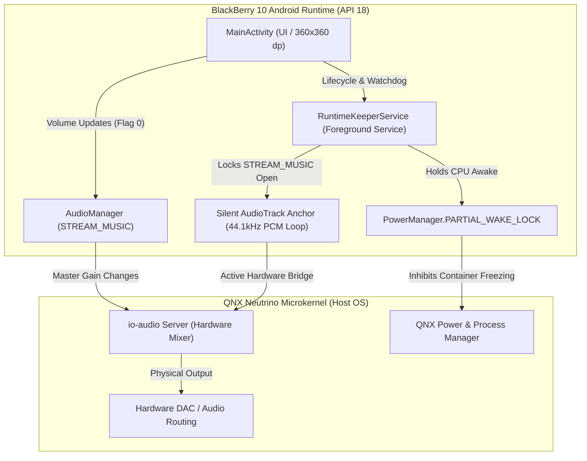

**English** • [Bahasa Indonesia](README.id.md)

# ClickyBB

### Lightweight Device Control Hub for BlackBerry 10 (Android Runtime / API 18)

[-00f0ff?style=for-the-badge&logo=android)](https://developer.android.com)
[](https://blackberry.com)
[-111111?style=for-the-badge)](https://en.wikipedia.org/wiki/BlackBerry_Q10)
[](https://developer.android.com/studio/command-line)
[]()
[](LICENSE)

---

## 1. Overview & Motivation

**ClickyBB** is a high-performance, minimalist device control utility engineered specifically for square-screen BlackBerry 10 smartphones. Operating inside BlackBerry 10's built-in Android Runtime (Android 4.3 Jelly Bean, API Level 18), ClickyBB directly resolves physical hardware wear issues that plague legacy BlackBerry smartphones over a decade after their release.

```
  Tested On:BlackBerry Q10 (720x720 Super AMOLED)
 ┌──────────────────────────────────────────────┐
 │  ClickyBB • UNIVERSAL HUB       STREAM_MUSIC │
 │                                              │
 │                    75%                       │
 │  [══════════════════●─────────────────────]  │
 │  [ -10% ]    [ MUTE ]    [ 50% ]    [ +10% ] │
 │                                              │
 │  STANDBY                      AMOLED 0W      │
 │  ┌────────────────────────────────────────┐  │
 │  │             SLEEP DISPLAY              │  │
 │  └────────────────────────────────────────┘  │
 │   Blackout display diodes • Wake with SPACE  │
 │                                              │
 │       AMOLED Black • 0% CPU Silent Anchor    │
 └──────────────────────────────────────────────┘
```

### The Hardware Fatigue Dilemma
1. **Top Power/Lock Button Degradation**: The physical dome switch under the top power button on the BlackBerry Q10 frequently collapses, sticks, or loses travel due to age and housing wear. Replacing the midframe rarely restores reliable switch feel, making locking the screen difficult or frustrating.
2. **Volume Rocker Key Flex Oxidation**: The side triple-button volume rocker assembly (Up, Mute/Voice, Down) oxidizes and wears out over time. Clicks are frequently missed, or buttons stick, causing unintended volume spikes or drops.
3. **QNX Microkernel Sandboxing**: Native Cascades (C++/Qt) third-party applications run inside heavily restricted sandboxes under QNX Neutrino and cannot access privileged PPS power nodes (`/pps/services/power/control`) or system volume daemons without root exploits.

### How ClickyBB Solves It
By executing within the integrated BlackBerry 10 Android Runtime container, ClickyBB hooks directly into the Android `AudioManager` and window brightness manager, providing:
- **Zero-Wear Media Volume Control**: A responsive on-screen master volume controller with tactile instant-preset chips.
- **True OLED Standby ("SLEEP DISPLAY")**: A pure `#000000` blackout overlay that physically powers off AMOLED display diodes without immediately locking the device, wakeable instantly with the physical keyboard **[SPACEBAR]** key.
- **Strict 1:1 Square Non-Scrolling Layout**: Handcrafted specifically for 720x720 displays (360x360 dp viewport) with zero vertical scrolling, zero clutter, and pure AMOLED black styling.

---

## 2. Key Features

| Feature | Description |
|---|---|
| **Chunky Master Slider** | Custom 28dp high-contrast touch slider with a prominent **34sp bold percentage readout** (`0%` to `100%`) for instant visual feedback. |
| **Instant Preset Chips** | Dedicated tactile capsule buttons: `-10%`, `MUTE` / `UNMUTE` (with previous level memory), `50%`, and `+10%` for quick adjustments without dragging. |
| **OLED Standby ("SLEEP DISPLAY")** | Instantly forces display brightness to `0.001f` and covers the viewport with pitch-black (`#000000`), physically extinguishing AMOLED subpixels (0W draw) to preserve battery. |
| **Physical Keyboard Spacebar Wake** | Standby mode can be dismissed in milliseconds by pressing the physical keyboard **[SPACEBAR]** or **[BACK]** key. |
| **Strict 1:1 Viewport** | 100% non-scrolling interface budgeted to fit entirely within the 360x360 dp. |
| **Ultra-Lightweight Footprint** | Complete APK size is under **64 KB**, containing zero heavy third-party libraries, zero AndroidX bloat, and zero background analytics. |

---

## 3. Deep-Dive Technical Architecture

ClickyBB overcomes several intricate architectural quirks and limitations unique to the BlackBerry 10 Android Runtime container.



### A. The QNX `io-audio` Bridge & The Silent Audio Anchor
On BlackBerry 10, the Android Runtime communicates with QNX's native audio server (`io-audio`) via a specialized IPC audio gateway. 

* **The Problem**: If no active audio track or media session is actively streaming in the Android container, QNX **disconnects and suspends the physical hardware mixer routing** for `STREAM_MUSIC`. In this dormant state, calling `AudioManager.setStreamVolume()` is acknowledged inside the Dalvik VM but **completely ignored by the underlying QNX hardware audio mixer**. This is why standalone volume sliders fail unless an external player (e.g. QyuPipe or native BB10 Music) is running in the background.
* **The Breakthrough**: `RuntimeKeeperService` provisions a lightweight, in-memory silent `AudioTrack` anchor:
  ```java
  // 44.1 kHz Mono 16-bit PCM (1:1 match with hardware audio DAC clock)
  int sampleRate = 44100;
  int bufferSize = Math.max(minBuf * 2, sampleRate * 2);
  byte[] silence = new byte[bufferSize]; // All zeros = mathematical digital silence

  mSilentAudioTrack = new AudioTrack(
          AudioManager.STREAM_MUSIC,
          sampleRate,
          AudioFormat.CHANNEL_OUT_MONO,
          AudioFormat.ENCODING_PCM_16BIT,
          bufferSize,
          AudioTrack.MODE_STATIC
  );

  mSilentAudioTrack.write(silence, 0, silence.length);
  mSilentAudioTrack.setLoopPoints(0, bufferSize / 2, -1); // Native kernel-level infinite loop
  mSilentAudioTrack.play();
  ```
* **0% CPU Overhead**: By utilizing `AudioTrack.MODE_STATIC` with native infinite loop points (`loopCount = -1`), the native Android `AudioFlinger` / QNX ALSA bridge maintains the hardware routing directly in kernel mixer memory. **No background thread loops, no buffer feeding, and 0% CPU consumption.**
* **Pure Digital Silence**: Because the buffer contains only digital zeroes (`0x00`), it mixes seamlessly with any active media playing on the device (`media_sample + 0 = media_sample`), causing zero distortion, zero ducking, and zero AudioFocus conflicts.

---

### B. Intelligent Battery Lifecycle & Deep Sleep Management
Running a background service and WakeLock indefinitely on a legacy BlackBerry device would cause severe battery drain. ClickyBB implements a strict, multi-tiered lifecycle manager:

1. **SLEEP DISPLAY Auto-Kill**:
   - When the user taps **SLEEP DISPLAY**, the app activates the blackout overlay and dims the screen.
   - When the physical screen turns off (`Intent.ACTION_SCREEN_OFF` broadcast):
     - ClickyBB immediately releases the `AudioTrack`, releases the `WakeLock`, unregisters receivers, calls `finishAffinity()`, and hard-terminates its own process:
       ```java
       Process.killProcess(Process.myPid());
       System.exit(0);
       ```
     - This allows QNX to drop immediately into deep C-states and sleep modes with **0 mAh standby drain**.
2. **Active Frame Multitasking Grace Period**:
   - When ClickyBB is minimized to an Active Frame on the BlackBerry 10 home screen (`onStop()`), the Foreground Service and silent audio anchor stay alive for a **3-minute grace period** (`180,000 ms`).
   - This allows users to switch between apps and adjust media volume seamlessly.
   - If the user returns to ClickyBB, the timer cancels and interaction resets.
3. **3-Minute Idle Watchdog**:
   - If left minimized or idle in the background without user interaction for 3 minutes, an internal Handler watchdog triggers `terminateProcess()`, halting the service and killing the process to prevent battery leakage.
4. **Clean Exit**:
   - Pressing **[BACK]** from the main dashboard or closing the app via the Active Frame close button immediately executes `terminateProcess()`.

---

### C. D8 Compiler & Modern Toolchain Compatibility
ClickyBB is built using modern developer toolchains (Java 21, Android SDK Build-Tools 28.0.3, D8 dexer) targeting Android 4.3 (API 18):

* **Avoiding the Java 21 / D8 Compiler Crash**: Java 21's `javac` generates synthetic `this$0` parameter attributes on inner class constructors that trigger a known `NullPointerException` inside legacy D8 dexers (`build-tools/28.0.3/lib/d8.jar`). 
* **Zero-Crash Architecture**: ClickyBB completely eliminates anonymous inner classes. All interfaces (`SeekBar.OnSeekBarChangeListener`, `View.OnClickListener`, `View.OnTouchListener`, `Runnable`) are implemented directly by top-level classes. Broadcast receivers use static nested classes with `WeakReference<MainActivity>` to prevent memory leaks and compiler attribute crashes.

---

## 4. Installation & Deployment Guide

### Method 1: Direct On-Device Install (Recommended)
1. Unduh berkas [**ClickyBB.apk**](https://github.com/irfanGaming720/ClickyBB/releases/download/V1.0/ClickyBB.apk) langsung ke perangkat BlackBerry 10 Anda (melalui BlackBerry Browser atau salin via kartu MicroSD/kabel USB).
2. Open the native **File Manager** app on your BlackBerry device.
3. Navigate to the folder containing `ClickyBB.apk` (e.g. `downloads/`).
4. Tap `ClickyBB.apk`, then tap **Install** in the top-right corner.
5. Once installed, tap **Open** or launch **ClickyBB** from your home screen.

### Method 2: Sideloading via ADB
If your BlackBerry 10 device has Development Mode enabled:
```bash
adb install -r ClickyBB.apk
```

### Device Compatibility
| Device | Screen Size & Type | Resolution | Compatibility |
|---|---|---|---|
| **BlackBerry Q10** | 3.1" Super AMOLED | 720 × 720 (1:1) | **Optimal (Primary Target)** |
| **BlackBerry Q20 Classic** | 3.5" IPS LCD | 720 × 720 (1:1) | **Fully Supported** |
| **BlackBerry Passport** | 4.5" IPS LCD | 1440 × 1440 (1:1) | **Fully Supported** |
| **BlackBerry Q5** | 3.1" IPS LCD | 720 × 720 (1:1) | **Fully Supported** |
| **BlackBerry Z10 / Z30** | Full Touchscreen | 1280 × 768 / 720 | Functional (Centered 1:1) |

*Tested on Blackberry Q10 OS versions 10.3.3.10.3.03.3216.*

---

## 5. Build Instructions (For Developers)

ClickyBB features a self-contained, lightning-fast compilation pipeline powered by a single PowerShell build script—no heavy Android Studio or Gradle installation required.

### Prerequisites
1. **Java Development Kit (JDK)**: JDK 8 or newer (JDK 21 fully supported).
2. **Android SDK Command-Line Tools**:
   - `build-tools/28.0.3` (providing `aapt.exe`, `d8.jar`, `zipalign.exe`, `apksigner.jar`).
   - `platforms/android-28/android.jar` (or API 18+ platform JAR).
3. **Debug Keystore**: Standard Android debug keystore located at `~/.android/debug.keystore`.

### Compiling the APK
Open PowerShell in the project directory and run:

```powershell
powershell -ExecutionPolicy Bypass -File .\build_apk.ps1
```

### Build Pipeline Steps
The build script automatically executes the following 6-stage pipeline:
1. **Purge**: Deletes `build/` directory to eliminate stale bytecode artifacts.
2. **AAPT Resource Compilation**: Generates `R.java` from `res/` and `AndroidManifest.xml`.
3. **Javac Compilation**: Compiles Java source files with `-source 8 -target 8`.
4. **D8 Dexing**: Transforms `.class` files into `classes.dex` optimized for API 18.
5. **AAPT Packaging & Zipalign**: Bundles drawables, layouts, and `classes.dex`, followed by 4-byte page alignment.
6. **Dual Signing (v1 + v2)**: Signs the APK with both JAR signing (v1) and APK Signature Scheme v2 (mandatory for BlackBerry 10 Android Runtime validation).

### Repository Language Clarification (`.gitattributes`)
The repository includes a `.gitattributes` configuration to prevent GitHub Linguist from misclassifying ClickyBB as PowerShell or XML:
```gitattributes
*.ps1 linguist-detectable=false
*.xml linguist-detectable=false
*.java linguist-detectable=true
```

---

## 6. Project Structure

```
ClickyBB/
├── .gitattributes                # Repository language mapping
├── AndroidManifest.xml           # Android 4.3 (API 18) manifest declaration
├── build_apk.ps1                 # Headless PowerShell compilation pipeline
├── ClickyBB.apk                  # Production-signed binary (~63 KB)
├── README.md                     # Documentation (English)
├── README.id.md                  # Documentation (Bahasa Indonesia)
├── res/                          # 100% Frozen AMOLED UI resources
│   ├── color/                    # Dynamic chip text color selectors
│   ├── drawable/                 # Pill buttons, seekbar drawables, card styles
│   ├── drawable-*/               # App launcher icons (mdpi to xxhdpi)
│   ├── layout/
│   │   └── activity_main.xml     # Non-scrolling 360x360 dp square viewport
│   └── values/                   # Colors, strings, AMOLED styles
└── src/com/clickybb/
    ├── MainActivity.java         # Master UI controller, standby & lifecycle logic
    └── RuntimeKeeperService.java # Foreground Service + Silent AudioTrack anchor
```

---

## 7. License

This project is released under the **MIT License**. You are free to use, modify, study, and distribute this software for personal and commercial purposes.
